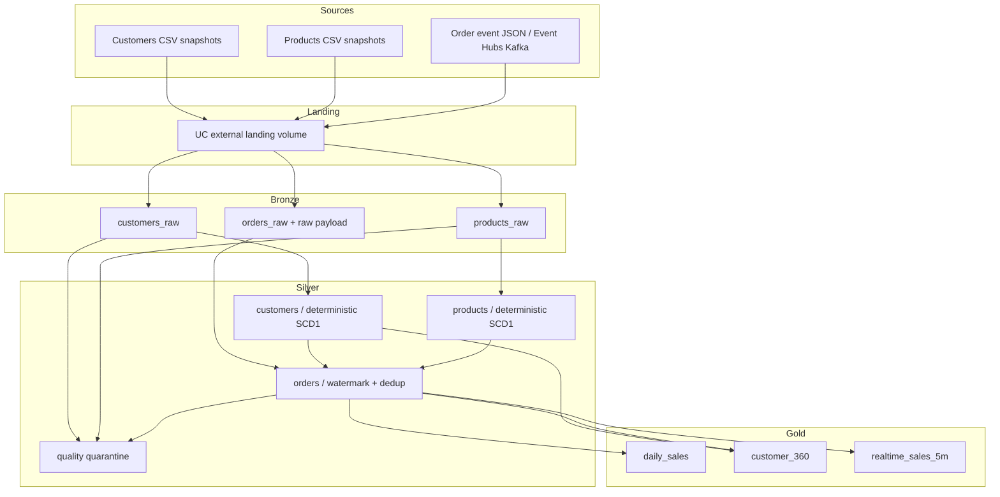

# Modern Data Platform Reference Architecture

[](https://github.com/MehdiTAZI/modern-data-platform-reference/actions/workflows/ci.yml)
[](LICENSE)

A production-oriented, architecture-first reference for designing and engineering a modern enterprise **Databricks Lakehouse** on Azure. It demonstrates platform infrastructure, Unity Catalog governance, batch and streaming data products, contract-driven quality, testing, CI/CD, observability, FinOps, recovery and the architectural decisions behind those patterns.

The repository deliberately implements **one deep retail/e-commerce vertical slice** instead of collecting unrelated snippets.

> **Deployment status:** V1.0 source, static validation and local test paths are reproducible without cloud credentials. V1.1 adds an explicit OIDC-first cloud-evidence workflow for Azure foundation apply, Unity Catalog governance, governed data upload, Bundle deployment/run and sanitized evidence capture. A real cloud run still requires your own disposable Azure/Databricks account and federated identities; no cloud execution or benchmark result is claimed until that workflow succeeds.

## Capability map

| Capability | Reference implementation |
|---|---|
| Cloud foundation | Azure Resource Group, ADLS Gen2, VNet injection, NSG, NAT Gateway, Databricks Premium workspace |
| Identity | Azure Databricks Access Connector managed identity + account-level Databricks groups + GitHub OIDC deployment identities |
| Governance | Unity Catalog catalog/schemas, managed storage, external landing volume, least-privilege grants |
| Batch ingestion | Lakeflow Spark Declarative Pipelines + Auto Loader for customers/products |
| Streaming ingestion | replayable raw order-event envelopes + Event Hubs/Kafka adapter |
| Medallion | Bronze source fidelity → Silver contracts/conformance → Gold data products |
| CDC/SCD | deterministic latest-state pattern with explicit SCD strategy ADR |
| Data quality | YAML contracts, Lakeflow expectations, quarantine and `_dq_errors` |
| Packaging | Python source package + wheel artifact |
| Application delivery | Databricks Declarative Automation Bundle |
| Testing | unit, Spark transformation, contract and deterministic failure-scenario tests |
| CI/CD | public lint/test/build/Terraform validation + gated OIDC cloud-evidence workflow |
| Terraform state | Azure Blob remote state with Microsoft Entra/OIDC authentication and separate foundation/governance keys |
| Observability | Databricks system-table reliability / FinOps / audit starter queries |
| FinOps | environment/workload tags + billing usage attribution |
| Recovery | replay boundary, checkpoint guidance, IaC reconstruction and runbooks |
| Architecture | logical/physical/security/deployment/DR diagrams + 24 ADRs + reference NFRs |

## End-to-end retail scenario



The deterministic sample-data generator includes normal records plus a customer update, invalid email, negative product price, duplicate event, unknown customer, invalid quantity, deliberately late event and corrupt JSON. This makes failure/recovery semantics observable and testable.

## Architecture principles

1. **Architecture follows explicit NFRs and decision records.**
2. **Terraform owns durable platform/governance boundaries; Bundles own application resources.**
3. **Serverless-first application compute; classic VNet injection remains an enterprise reference.**
4. **Unity Catalog is the authorization and storage abstraction boundary.**
5. **Managed analytical tables; external volumes for externally-owned landing data.**
6. **Bronze is replayable and source-oriented; Silver is contract-oriented; Gold is consumer-oriented.**
7. **At-least-once input + stable event IDs + watermarking instead of vague exactly-once claims.**
8. **Business transformations are reusable Python functions, not notebook-only logic.**
9. **Invalid data is explicit: fail, quarantine or measure; never silently disappear.**
10. **Operational evidence—quality, reliability, cost, security and recovery—is part of the architecture.**

## Repository map

```text
.
├── databricks.yml
├── resources/
├── pipelines/retail/
├── src/mdpr/retail/
├── contracts/retail/
├── tests/
├── infra/
│   ├── modules/
│   └── stacks/
├── observability/sql/
├── governance/sql/
├── docs/
│   ├── architecture/
│   ├── adr/
│   ├── deployment/
│   ├── evidence/
│   ├── nfr/
│   ├── patterns/
│   ├── runbooks/
│   └── standards/
└── .github/workflows/
```

## Architecture documentation

- [Architecture overview](docs/architecture/overview.md)
- [Azure physical architecture](docs/architecture/physical-azure.md)
- [Identity and governance](docs/architecture/identity-and-governance.md)
- [Security architecture](docs/architecture/security-architecture.md)
- [Deployment architecture](docs/architecture/deployment.md)
- [V1.1 cloud deployment evidence](docs/deployment/cloud-evidence.md)
- [Deployment evidence policy](docs/evidence/README.md)
- [Observability and FinOps](docs/architecture/observability.md)
- [Disaster recovery](docs/architecture/disaster-recovery.md)
- [Reference NFRs](docs/nfr/reference-nfrs.md)
- [ADR index](docs/adr/README.md)

## Local validation

Requirements: Python 3.11+ and Terraform 1.15.x for the same validation path as CI.

```bash
python -m pip install -e '.[dev]'
make data
make lint
make test
make build
make contracts
make docs
make terraform-fmt
make terraform-validate
```

## Azure foundation

The foundation uses a remote `azurerm` backend in real deployments. For credential-free local structural validation, do not invent backend values:

```bash
terraform -chdir=infra/stacks/azure-foundation init -backend=false
terraform -chdir=infra/stacks/azure-foundation validate
```

The foundation creates the VNet-injected classic-network reference, HNS-enabled ADLS Gen2 storage, Databricks Access Connector managed identity, Event Hubs Kafka-compatible source, storage/Event Hubs RBAC, Log Analytics workspace and Databricks workspace.

For a real plan/apply with persistent state, use the documented [V1.1 cloud-evidence lifecycle](docs/deployment/cloud-evidence.md) rather than a local ephemeral state file.

## Unity Catalog governance

The governance root is intentionally a separate Terraform state from the Azure foundation. Local structural validation is:

```bash
terraform -chdir=infra/stacks/workspace-governance init -backend=false
terraform -chdir=infra/stacks/workspace-governance validate
```

A real deployment applies the Azure foundation first, derives its workspace/storage/access-connector outputs, then applies workspace governance through its own remote-state key. The stack assumes the organization has already synchronized the referenced account-level groups. Enterprise identity lifecycle is an account/IdP concern, not a workspace-local bootstrap trick.

## Databricks application deployment

With a configured Databricks authentication context:

```bash
python -m build --wheel
databricks bundle validate -t dev --var="workspace_host=$DATABRICKS_HOST"
databricks bundle deploy -t dev --var="workspace_host=$DATABRICKS_HOST"
databricks bundle run -t dev retail_refresh
```

The Bundle deploys serverless Bronze/Silver/Gold Lakeflow pipelines plus an orchestration job. DEV/STAGING/PROD consistently map to `retail_dev`, `retail_stg`, and `retail_prd`.

## V1.1 cloud evidence

The manual `V1.1 Cloud Evidence` GitHub Actions workflow is the authoritative end-to-end demonstration path:

```text
GitHub OIDC
    ↓
Azure state bootstrap
    ↓
Azure foundation Terraform apply
    ↓
Databricks OIDC + Unity Catalog governance apply
    ↓
Functional or benchmark data generation
    ↓
Governed ADLS landing upload
    ↓
Bundle validate → deploy → Bronze → Silver → Gold run
    ↓
Sanitized Actions evidence artifact
    ↓
Reviewed evidence may be curated under docs/evidence/
```

The workflow also provides an explicit reverse-order `destroy` action. See [cloud-evidence.md](docs/deployment/cloud-evidence.md) and [ADR-024](docs/adr/ADR-024-remote-state-and-deployment-evidence.md).

## Production adoption checklist

Before production adoption, decide and validate Azure Private Link/private DNS/firewall policy, real source retention/connectivity, enterprise identity ownership, regional storage/DR requirements, measured load/skew/concurrency, central PII policies, budgets and enterprise observability integration.

## License

Apache License 2.0. See [LICENSE](LICENSE).
