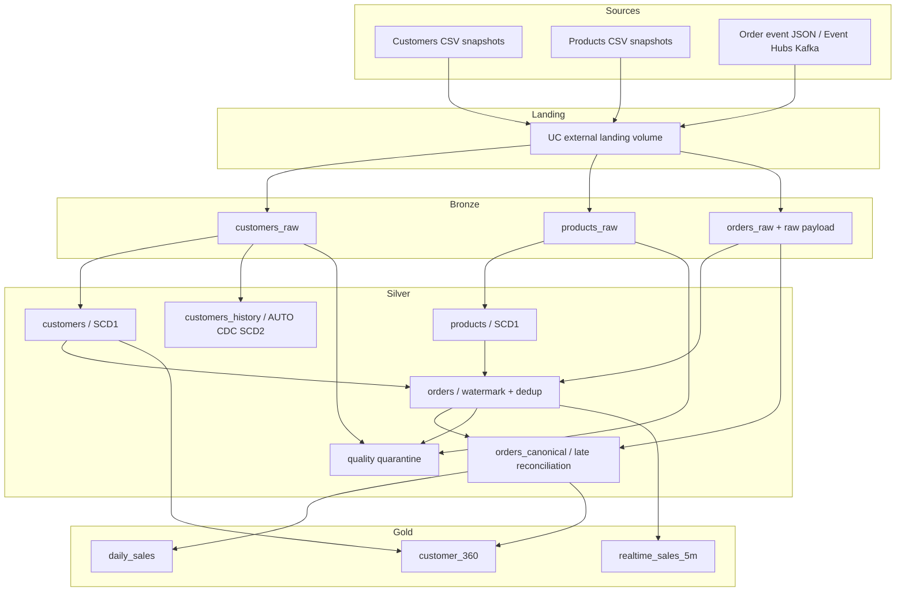

# Modern Data Platform Reference Architecture

[](https://github.com/MehdiTAZI/modern-data-platform-reference/actions/workflows/ci.yml)
[](LICENSE)

A production-oriented, architecture-first reference for designing and engineering a modern enterprise **Databricks Lakehouse** on Azure. It demonstrates platform infrastructure, Unity Catalog governance, batch and streaming data products, contract-driven quality, CDC/SCD, testing, CI/CD, observability, FinOps, recovery, software supply-chain controls and the architectural decisions behind those patterns.

The repository deliberately implements **one deep retail/e-commerce vertical slice** instead of collecting unrelated snippets.

> **Deployment status:** V1.0 source/static validation is reproducible without cloud credentials. V1.1 adds OIDC-first cloud-evidence automation but a real cloud run still requires your disposable Azure/Databricks account and federated identities. V1.2 adds AUTO CDC SCD2, contract migration, late-event reconciliation, backend Private Link, ABAC PII masking and secondary-region DR patterns. V1.3 adds immutable GitHub Action references, dependency auditing, release checksums, CycloneDX SBOMs and signed artifact attestations. V1.4 adds committed multi-platform Terraform provider lockfiles and readonly lock enforcement. Environment-dependent cloud controls are not claimed as deployed until exercised in a real account.

## Capability map

| Capability | Reference implementation |
|---|---|
| Cloud foundation | Azure RG, ADLS Gen2, VNet injection, NSG, NAT baseline, optional backend Private Link/private DNS, Databricks Premium |
| Identity | Databricks Access Connector managed identity + account-level groups + GitHub OIDC deployment identities |
| Governance | Unity Catalog catalog/schemas/storage/grants + governed-tag ABAC PII masking example |
| Batch ingestion | Lakeflow Spark Declarative Pipelines + Auto Loader for customers/products |
| Streaming ingestion | replayable raw order envelopes + Event Hubs/Kafka adapter |
| Medallion | Bronze source fidelity → Silver contracts/conformance → Gold data products |
| CDC/SCD | deterministic SCD1 current state + Lakeflow AUTO CDC SCD2 customer history |
| Schema evolution | rescued Bronze fields + versioned contract compatibility/migration example |
| Late data | bounded streaming watermark + Bronze reconciliation + canonical analytical orders |
| Data quality | YAML contracts, Lakeflow expectations, quarantine and `_dq_errors` |
| Packaging | Python source package + wheel/sdist release artifacts |
| Application delivery | Databricks Declarative Automation Bundle |
| Testing | unit, Spark transformation, contract and deterministic failure-scenario tests |
| CI/CD | SHA-pinned Actions, lint/test/build, dependency/secret scans, readonly Terraform lock validation + gated OIDC cloud evidence |
| Supply chain | pip-audit, CycloneDX SBOM, SHA-256 checksums, GitHub/Sigstore attestations + multi-platform Terraform provider locks |
| Terraform state | Azure Blob remote state with Entra/OIDC auth and separate foundation/governance keys |
| Terraform dependencies | per-root `.terraform.lock.hcl`, AzureRM 4.81.0 / Databricks 1.128.0, Linux + Intel/ARM macOS hashes |
| Observability | Databricks system-table reliability / FinOps / audit starter queries |
| FinOps | environment/workload tags + billing usage attribution |
| Recovery/DR | replay/reconciliation + IaC reconstruction + Managed-DR-aligned secondary Azure substrate |
| Architecture | logical/physical/security/deployment/DR diagrams + 27 ADRs + reference NFRs |

## End-to-end retail scenario



The deterministic functional dataset includes a customer update, invalid email, negative product price, duplicate event, unknown customer, invalid quantity, deliberately late event and corrupt JSON. This makes quality, ordering and recovery semantics observable rather than theoretical.

## Architecture principles

1. **Architecture follows explicit NFRs and decision records.**
2. **Terraform owns durable platform/governance boundaries; Bundles own application resources.**
3. **Serverless-first application compute; classic VNet injection remains an enterprise reference.**
4. **Unity Catalog is the authorization and storage abstraction boundary.**
5. **Managed analytical tables; external volumes for externally-owned landing data.**
6. **Bronze is replayable/source-oriented; Silver contract-oriented; Gold consumer-oriented.**
7. **Bound streaming state deliberately; reconcile late business data instead of hiding it.**
8. **Business transformations are reusable Python functions, not notebook-only logic.**
9. **Invalid data is explicit: fail, quarantine or measure; never silently disappear.**
10. **Security, cost, recovery, dependency provenance and operational evidence are part of the architecture.**

## Repository map

```text
.
├── databricks.yml
├── resources/
├── pipelines/retail/
├── src/mdpr/retail/
├── contracts/retail/
├── tests/
├── infra/
│   ├── modules/
│   └── stacks/
│       ├── state-backend/.terraform.lock.hcl
│       ├── azure-foundation/.terraform.lock.hcl
│       ├── workspace-governance/.terraform.lock.hcl
│       └── azure-dr-secondary/.terraform.lock.hcl
├── observability/sql/
├── governance/sql/
├── docs/
└── .github/workflows/
```

## Architecture documentation

- [Architecture overview](docs/architecture/overview.md)
- [Azure physical architecture](docs/architecture/physical-azure.md)
- [Identity and governance](docs/architecture/identity-and-governance.md)
- [Security architecture](docs/architecture/security-architecture.md)
- [Deployment architecture](docs/architecture/deployment.md)
- [Disaster recovery](docs/architecture/disaster-recovery.md)
- [Reference NFRs](docs/nfr/reference-nfrs.md)
- [ADR index](docs/adr/README.md)
- [Software supply-chain standard](docs/standards/supply-chain.md)
- [Validation/evidence matrix](docs/evidence/validation-matrix.md)
- [V1.1 cloud deployment evidence](docs/deployment/cloud-evidence.md)

## Local validation

Requirements: Python 3.11+ and Terraform 1.15.x for the same validation path as CI.

```bash
python -m pip install -e '.[dev]'
make data
make policy
make lint
make test
make audit
make build
make sbom
make contracts
make docs
make terraform-fmt
make terraform-validate
```

## Terraform dependency reproducibility

Every executable Terraform root commits a dependency lockfile generated from the origin registries for `linux_amd64`, `darwin_amd64`, and `darwin_arm64`. Normal validation does not permit Terraform to rewrite provider selections:

```bash
terraform -chdir=infra/stacks/azure-foundation init -backend=false -input=false -lockfile=readonly
terraform -chdir=infra/stacks/azure-foundation validate
```

Provider constraints still define compatibility; lockfiles record the currently reviewed provider release and checksums. See [ADR-027](docs/adr/ADR-027-terraform-provider-lockfiles.md).

## Azure foundation

The foundation uses a remote `azurerm` backend in real deployments. The baseline creates VNet-injected classic networking, HNS-enabled ADLS Gen2, Databricks Access Connector, Event Hubs, Log Analytics and a Premium workspace. `enable_private_link=true` switches to the documented backend-only classic compute Private Link profile; it does not imply full private user/serverless connectivity.

For a real plan/apply with persistent state, use the [V1.1 cloud-evidence lifecycle](docs/deployment/cloud-evidence.md).

## Unity Catalog governance

The governance root is intentionally separate Terraform state from the Azure foundation. It assumes referenced account-level groups already exist. Enterprise identity lifecycle remains an account/IdP concern. The ABAC PII example is deliberately separate SQL because governed-tag taxonomy and policy ownership are governance responsibilities, not an implicit application deployment side effect.

## Databricks application deployment

With a configured Databricks authentication context:

```bash
python -m build --wheel
databricks bundle validate -t dev --var="workspace_host=$DATABRICKS_HOST"
databricks bundle deploy -t dev --var="workspace_host=$DATABRICKS_HOST"
databricks bundle run -t dev retail_refresh
```

The Bundle deploys serverless Bronze/Silver/Gold Lakeflow pipelines plus orchestration. DEV/STAGING/PROD consistently map to `retail_dev`, `retail_stg`, and `retail_prd`.

## Secondary-region DR substrate

The V1.2 secondary root is structurally validated with the same readonly provider lock policy. A real deployment needs its own remote-state key and region-specific values. This root provisions Azure substrate only; Databricks Mission Critical/Managed DR/failover-group configuration is an account-level prerequisite and must be evidenced separately.

## Release provenance

A `vX.Y.Z` tag must match `project.version`. The dedicated release workflow builds wheel and source distribution artifacts, audits project dependencies, emits a CycloneDX JSON SBOM and `SHA256SUMS`, creates GitHub/Sigstore build and SBOM attestations, and publishes the same evidence to the GitHub Release. See [ADR-026](docs/adr/ADR-026-software-supply-chain-and-release-provenance.md).

## Production adoption checklist

Before production adoption, validate the chosen Private Link/inbound/serverless networking profile, source retention/connectivity, enterprise identity ownership, ABAC tag/policy governance, regional Managed DR eligibility, measured load/skew/concurrency, budgets, enterprise observability integration and organizational software-supply-chain policy.

## License

Apache License 2.0. See [LICENSE](LICENSE).
