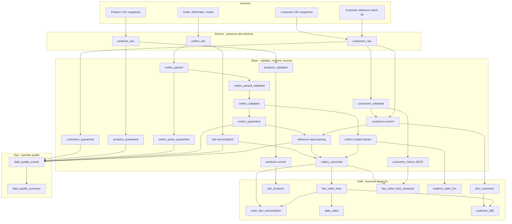

# Modern Data Platform Reference Architecture

[](https://github.com/MehdiTAZI/modern-data-platform-reference/actions/workflows/ci.yml)
[](LICENSE)

A production-oriented, architecture-first reference for designing and engineering a modern enterprise **Databricks Lakehouse** on Azure. It demonstrates platform infrastructure, Unity Catalog governance, a deep Bronze/Silver/Gold application workflow, batch and streaming data products, contract-driven quality, remediation, CDC/SCD, temporal analytics, testing, CI/CD, observability, FinOps, recovery, software supply-chain controls and the architectural decisions behind those patterns.

The repository deliberately implements **one deep retail/e-commerce vertical slice** instead of collecting unrelated snippets.

> **Deployment status:** V1.0 source/static validation is reproducible without cloud credentials. V1.1 adds OIDC-first cloud-evidence automation but a real cloud run still requires a disposable Azure/Databricks account and federated identities. V1.2 adds AUTO CDC SCD2, contract migration, late-event reconciliation, backend Private Link, ABAC PII masking and secondary-region DR patterns. V1.3 adds software supply-chain/release controls. V1.4 adds reproducible Terraform provider dependencies. V1.5 completes the medallion trust workflow. **V1.6 deepens application engineering with quality telemetry, immutable-quarantine remediation, SCD2 as-of facts and dataset-level accounting assertions.** Environment-dependent Lakeflow and cloud controls are not claimed as runtime-proven until exercised in a real account.

## Capability map

| Capability | Reference implementation |
|---|---|
| Cloud foundation | Azure RG, ADLS Gen2, VNet injection, NSG, NAT baseline, optional backend Private Link/private DNS, Databricks Premium |
| Identity | Databricks Access Connector managed identity + account-level groups + GitHub OIDC deployment identities |
| Governance | Unity Catalog catalog/schemas/storage/grants + governed-tag ABAC PII masking example |
| Batch ingestion | Lakeflow Spark Declarative Pipelines + Auto Loader for customers/products |
| Streaming ingestion | replayable raw order envelopes + Event Hubs/Kafka adapter |
| Bronze | source-faithful raw data, transport metadata, rescued schema drift, payload fingerprints, warn-only expectations |
| Silver | typed conformance, explicit validated/quarantine paths, two-stage order quality gate, watermark/dedup/reference integrity |
| Remediation | immutable quarantine + full-contract reference-data reprocessing + late-event reconciliation |
| CDC/SCD | deterministic SCD1 current state + Lakeflow AUTO CDC SCD2 customer history sourced from validated data |
| Temporal analytics | event-time as-of join from canonical orders to SCD2 customer history |
| Schema evolution | rescued Bronze fields + versioned contract compatibility/migration example |
| Late data | bounded streaming watermark + Bronze reconciliation + canonical analytical orders |
| Data quality | YAML contracts, categorized rules, Lakeflow metric/drop/fail expectations, `_dq_errors`, quality events and summaries |
| Dataset assertions | row accounting + additive metric reconciliation across trusted processing boundaries |
| Gold | customer/product dimensions, order-line facts, temporal fact, exact daily/customer aggregates, five-minute streaming KPI |
| Operations | dedicated Ops Lakeflow pipeline with normalized DQ events/summary and system-table starter queries |
| Packaging | Python source package + wheel/sdist release artifacts |
| Application delivery | Databricks Declarative Automation Bundle with Bronze → Silver → Gold/Ops orchestration |
| Testing | unit, Spark transformation, contract, remediation, temporal, reconciliation and deterministic failure-scenario tests |
| CI/CD | SHA-pinned Actions, lint/test/build, dependency/secret scans, readonly Terraform lock validation + gated OIDC cloud evidence |
| Supply chain | pip-audit, CycloneDX SBOM, SHA-256 checksums, GitHub/Sigstore attestations + multi-platform Terraform provider locks |
| Terraform state | Azure Blob remote state with Entra/OIDC auth and separate foundation/governance keys |
| Terraform dependencies | per-root `.terraform.lock.hcl`, AzureRM 4.81.0 / Databricks 1.128.0, Linux + Intel/ARM macOS hashes |
| Observability | Databricks system-table reliability / FinOps / audit + DQ/reconciliation operational queries |
| FinOps | environment/workload tags + billing usage attribution |
| Recovery/DR | replay/reconciliation/remediation + IaC reconstruction + Managed-DR-aligned secondary Azure substrate |
| Architecture | logical/physical/security/deployment/DR diagrams + 30 ADRs + reference NFRs |

## Complete retail application workflow



The important application rule is that each zone has a different responsibility:

- **Bronze preserves source fidelity.** It captures payloads, ingestion/transport metadata, payload fingerprints and schema drift. Expectations measure anomalies but do not destroy business records.
- **Silver is the trust boundary.** Invalid rows are classified and quarantined. Orders have a parse/shape gate **before** watermarking/deduplication, then a business/reference gate after conformance. Trusted Silver outputs use fail expectations only for invariants that should be impossible to violate after those gates.
- **Remediation is explicit.** Event-time lateness and reference-data lateness are separate recovery paths. Original quarantine evidence remains immutable and the complete current contract is re-evaluated before a recovered row can enter canonical data.
- **Gold models for consumers.** It creates current dimensions, canonical and temporal facts, batch/streaming business aggregates and dataset-level accounting assertions. Gold does not repair source defects; broken trusted invariants fail fast.
- **Ops makes quality operable.** Heterogeneous quarantine reasons become normalized, payload-minimized quality events and summaries suitable for dashboards/alerts.

See the [complete application-pipeline walkthrough](docs/patterns/application-pipeline.md), [ADR-028](docs/adr/ADR-028-silver-quality-gates-and-invariants.md), [ADR-029](docs/adr/ADR-029-quality-telemetry-and-reprocessing.md) and [ADR-030](docs/adr/ADR-030-temporal-dimensional-consistency.md).

## Expectations and assertions

| Mechanism | Layer | Meaning in this reference |
|---|---|---|
| `expect` / `expect_all` | Bronze + metric controls | Observe and report without altering the dataset |
| `expect_all_or_drop` | Silver quality gates | Prevent invalid rows entering trusted outputs; matching quarantine tables retain rejects and reasons |
| `expect_or_fail` / `expect_all_or_fail` | Trusted Silver + Gold + reconciliation | Assertion-like invariant: stop the affected flow if post-gate assumptions are broken |
| Python `assert` / pytest assertions | CI | Test reusable transformation, remediation and accounting behavior before deployment |

Only `TRUE` satisfies the reusable row-quality contract logic; `FALSE` and `NULL` are violations. An invalid source row is a data-quality event; a violated invariant on a trusted dataset is an application regression or contract failure.

## Quality and remediation lifecycle

```text
source record
    ↓
quality gate
    ├── valid ───────────────→ trusted Silver
    │
    └── invalid → quarantine ───────────────┐
                      │                     │
                      └→ DQ telemetry       │
                                            │
reference catches up / replay condition ────┘
                      ↓
              full contract revalidation
                      ↓
             recovered or still rejected
```

The deterministic functional dataset includes an unknown customer `C999`. The initial run quarantines its order. A generated second-phase customer file introduces `C999`; after refresh, the reference reprocessing path can recover the order while preserving the original rejection as audit evidence.

## Dataset-level reconciliation

V1.6 adds controls beyond row expectations. The canonical Silver-to-Gold order boundary checks both:

```text
COUNT(silver.orders_canonical) = COUNT(gold.fact_order_lines)
```

and:

```text
SUM(quantity * unit_price) ~= SUM(line_amount)
```

A mismatch fails the Gold reconciliation surface because lost/duplicated rows or amount drift are trusted-transformation failures, not dirty-source events.

## Temporal dimensional consistency

Current-state customer data is used for low-latency referential validation. Historical analytics use the SCD2 validity interval:

```text
order.event_time >= customer_history.__START_AT
AND (customer_history.__END_AT IS NULL
     OR order.event_time < customer_history.__END_AT)
```

`fact_order_lines_temporal` records only the resolved customer-version interval, minimizing PII duplication while proving historical-state resolution.

## Architecture principles

1. **Architecture follows explicit NFRs and decision records.**
2. **Terraform owns durable platform/governance boundaries; Bundles own application resources.**
3. **Serverless-first application compute; classic VNet injection remains an enterprise reference.**
4. **Unity Catalog is the authorization and storage abstraction boundary.**
5. **Managed analytical tables; external volumes for externally-owned landing data.**
6. **Bronze is replayable/source-oriented; Silver contract-oriented; Gold consumer-oriented; Ops operational.**
7. **Bound streaming state deliberately; reconcile late business data instead of hiding it.**
8. **Business transformations are reusable Python functions, not notebook-only logic.**
9. **Invalid data is explicit: measure, quarantine, remediate or fail according to boundary semantics; never silently disappear.**
10. **Trusted boundaries use both row invariants and dataset-level accounting controls.**
11. **Historical facts resolve the dimension state valid at business event time when temporal semantics matter.**
12. **Security, cost, recovery, dependency provenance and operational evidence are part of the architecture.**

## Repository map

```text
.
├── databricks.yml
├── resources/
│   ├── bronze.pipeline.yml
│   ├── silver.pipeline.yml
│   ├── gold.pipeline.yml
│   ├── ops.pipeline.yml
│   └── retail.job.yml
├── pipelines/retail/
│   ├── bronze.py
│   ├── silver.py
│   ├── history.py
│   ├── reconciliation.py
│   ├── quality_telemetry.py
│   └── gold.py
├── src/mdpr/retail/
│   ├── contracts.py
│   ├── quality.py
│   └── transforms/
├── contracts/retail/
├── tests/
├── infra/
│   ├── modules/
│   └── stacks/
├── observability/sql/
├── governance/sql/
├── docs/
└── .github/workflows/
```

## Architecture documentation

- [Complete application pipeline](docs/patterns/application-pipeline.md)
- [Architecture overview](docs/architecture/overview.md)
- [Azure physical architecture](docs/architecture/physical-azure.md)
- [Identity and governance](docs/architecture/identity-and-governance.md)
- [Security architecture](docs/architecture/security-architecture.md)
- [Deployment architecture](docs/architecture/deployment.md)
- [Disaster recovery](docs/architecture/disaster-recovery.md)
- [Reference NFRs](docs/nfr/reference-nfrs.md)
- [ADR index](docs/adr/README.md)
- [Software supply-chain standard](docs/standards/supply-chain.md)
- [Validation/evidence matrix](docs/evidence/validation-matrix.md)
- [V1.1 cloud deployment evidence](docs/deployment/cloud-evidence.md)

## Local validation

Requirements: Python 3.11+ and Terraform 1.15.x for the same validation path as CI.

```bash
python -m pip install -e '.[dev]'
make data
make policy
make lint
make test
make audit
make build
make sbom
make contracts
make docs
make terraform-fmt
make terraform-validate
```

## Databricks application deployment

With a configured Databricks authentication context:

```bash
python -m build --wheel
databricks bundle validate -t dev --var="workspace_host=$DATABRICKS_HOST"
databricks bundle deploy -t dev --var="workspace_host=$DATABRICKS_HOST"
databricks bundle run -t dev retail_refresh
```

The Bundle deploys four serverless Lakeflow pipelines and one orchestration job:

```text
retail_bronze
    ↓
retail_silver
    ├────────→ retail_gold
    └────────→ retail_ops
```

DEV/STAGING/PROD consistently map to `retail_dev`, `retail_stg`, and `retail_prd`.

### Reference catch-up demonstration

After the initial generated dataset has produced the expected unknown-customer quarantine, upload the generated second-phase fixture:

```bash
bash scripts/upload_reference_catchup.sh
```

using the same `STORAGE_ACCOUNT`, `FILESYSTEM`, `CATALOG`, `SOURCE_DIR` and a new `RUN_SUFFIX`, then rerun `retail_refresh`. The order referencing `C999` can become a reference-reprocessing candidate and enter `orders_canonical` if all current rules pass.

## Terraform dependency reproducibility

Every executable Terraform root commits a dependency lockfile generated from the origin registries for `linux_amd64`, `darwin_amd64`, and `darwin_arm64`. Normal validation does not permit Terraform to rewrite provider selections:

```bash
terraform -chdir=infra/stacks/azure-foundation init -backend=false -input=false -lockfile=readonly
terraform -chdir=infra/stacks/azure-foundation validate
```

Provider constraints still define compatibility; lockfiles record the currently reviewed provider release and checksums. See [ADR-027](docs/adr/ADR-027-terraform-provider-lockfiles.md).

## Azure foundation

The foundation uses a remote `azurerm` backend in real deployments. The baseline creates VNet-injected classic networking, HNS-enabled ADLS Gen2, Databricks Access Connector, Event Hubs, Log Analytics and a Premium workspace. `enable_private_link=true` switches to the documented backend-only classic compute Private Link profile; it does not imply full private user/serverless connectivity.

For a real plan/apply with persistent state, use the [V1.1 cloud-evidence lifecycle](docs/deployment/cloud-evidence.md).

## Unity Catalog governance

The governance root is intentionally separate Terraform state from the Azure foundation. It assumes referenced account-level groups already exist. Enterprise identity lifecycle remains an account/IdP concern. The ABAC PII example is deliberately separate SQL because governed-tag taxonomy and policy ownership are governance responsibilities, not an implicit application deployment side effect.

## Secondary-region DR substrate

The V1.2 secondary root is structurally validated with the same readonly provider lock policy. A real deployment needs its own remote-state key and region-specific values. This root provisions Azure substrate only; Databricks Mission Critical/Managed DR/failover-group configuration is an account-level prerequisite and must be evidenced separately.

## Release provenance

A `vX.Y.Z` tag must match `project.version`. The dedicated release workflow builds wheel and source distribution artifacts, audits project dependencies, emits a CycloneDX JSON SBOM and `SHA256SUMS`, creates GitHub/Sigstore build and SBOM attestations, and publishes the same evidence to the GitHub Release. See [ADR-026](docs/adr/ADR-026-software-supply-chain-and-release-provenance.md).

## Production adoption checklist

Before production adoption, validate Lakeflow expectation/runtime behavior, AUTO CDC execution and SCD interval integrity, streaming state and throughput, remediation volume/retention, quality-alert thresholds, the chosen Private Link/inbound/serverless networking profile, source retention/connectivity, enterprise identity ownership, ABAC tag/policy governance, regional Managed DR eligibility, measured load/skew/concurrency, budgets, enterprise observability integration and organizational software-supply-chain policy.

## Next platform-engineering focus

V1.7 is planned as the Terraform/platform deep dive: deployment profiles, serverless networking/NCC, Terraform tests, policy-as-code, plan-time security/FinOps controls, deeper Unity Catalog ownership/bindings and hardened connectivity patterns. See [ROADMAP.md](ROADMAP.md).

## License

Apache License 2.0. See [LICENSE](LICENSE).
