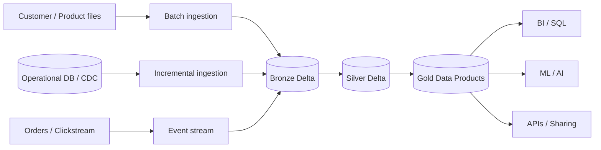
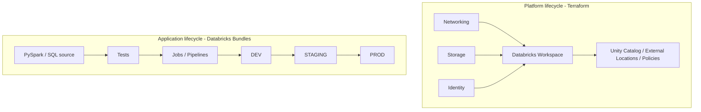

# Modern Data Platform Reference Architecture

A production-oriented reference implementation of a modern enterprise data platform built around **Databricks, Delta Lake, Unity Catalog, Terraform, PySpark, SQL, batch and streaming workloads**.

The goal is not to provide isolated code snippets. The repository demonstrates how architecture decisions, platform engineering, data engineering, governance, security, testing, observability and CI/CD fit together in one coherent platform.

> **Reference implementation:** Azure + Databricks is used for the first implementation. The architecture deliberately separates cloud-specific infrastructure from Databricks and application concerns so AWS/GCP implementations can be added later.

## What this repository demonstrates

| Capability | Coverage |
|---|---|
| Infrastructure as Code | Terraform modules and environment composition |
| Lakehouse | Delta Lake + Medallion architecture |
| Governance | Unity Catalog ownership, isolation and access model |
| Batch processing | Incremental ingestion and Bronze → Silver → Gold |
| Real-time processing | Structured Streaming ingestion and transformations |
| Data quality | Expectations, validation patterns and quarantine strategy |
| Data engineering | PySpark + SQL application patterns |
| CI/CD | GitHub Actions + Terraform + Databricks Bundles |
| Architecture | HLD, data flows, standards and ADRs |
| Operations | Observability, FinOps and operational principles |

## Reference use case

The sample domain is a simplified **retail / e-commerce platform**:

- Customers and products are ingested in batch.
- Orders and clickstream events are ingested in near real time.
- Bronze stores immutable/raw representations.
- Silver validates, deduplicates and conforms entities.
- Gold exposes business-ready data products and KPIs.



## Architecture principles

1. **Everything as code** — infrastructure, platform resources, jobs and pipelines are version controlled.
2. **Clear lifecycle boundaries** — Terraform owns platform infrastructure; Databricks Bundles own application deployment.
3. **Batch and streaming converge** — both patterns write governed Delta tables and share transformation logic where useful.
4. **Governance by design** — Unity Catalog, least privilege, environment isolation and ownership are part of the architecture.
5. **Production before notebooks** — reusable Python/SQL modules are preferred over notebook-only implementations.
6. **Idempotent and observable pipelines** — restartability, lineage, quality controls and measurable SLIs are first-class concerns.
7. **Architecture decisions are explicit** — major choices are documented as ADRs with alternatives and consequences.

## Repository structure

```text
.
├── docs/                    # Architecture, ADRs and engineering standards
├── platform/terraform/      # Cloud + Databricks platform infrastructure
├── applications/retail/     # Batch, streaming and Gold application examples
├── bundles/retail/          # Databricks deployment definition
├── templates/               # Reusable project templates
├── tests/                   # Unit, integration, DQ and infrastructure tests
├── examples/retail/         # End-to-end scenario documentation
└── .github/workflows/       # CI/CD pipelines
```

## Platform vs application ownership



## Delivery roadmap

- **D0 — Vision:** repository structure, architecture principles and reference scenario.
- **D1 — Architecture:** logical/physical architecture, security, governance and initial ADR set.
- **D2 — Platform foundation:** Terraform composition for Azure + Databricks + Unity Catalog.
- **D3 — Batch pipeline:** Customers/Products → Bronze → Silver → Gold.
- **D4 — Streaming pipeline:** Orders/Clickstream → Bronze → Silver → real-time Gold.
- **D5 — Engineering framework:** configuration, logging, DQ, testing and reusable templates.
- **D6 — CI/CD:** pull-request validation and controlled promotion.
- **D7 — Governance & security:** fine-grained access patterns, lineage and classification.
- **D8 — Observability & FinOps:** operational dashboards, SLIs/SLOs and cost controls.
- **D9 — Advanced patterns:** CDC, SCD2, replay, schema evolution, DR and performance.

## Quick start

### Local quality checks

```bash
python -m pip install -e '.[dev]'
make test
make lint
```

### Terraform validation

```bash
cd platform/terraform/environments/dev
terraform init -backend=false
terraform validate
```

### Databricks bundle validation

```bash
cd bundles/retail
databricks bundle validate -t dev
```

## Status

This repository starts with the architecture and production engineering skeleton. The roadmap intentionally grows the implementation vertically: one complete scenario is preferred over many disconnected demos.

See [the architecture overview](docs/architecture/overview.md), [ADR index](docs/adr/README.md) and [retail scenario](examples/retail/README.md).
