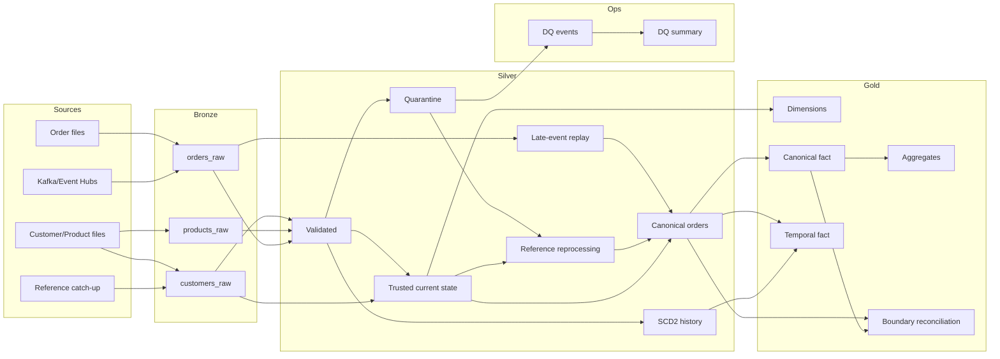

# Data Flow

The reference uses one retail vertical slice to demonstrate batch snapshots, streaming events, medallion trust boundaries, recovery paths, temporal history and operational quality telemetry.

## Ingestion boundary

Files enter a governed external landing volume and are incrementally ingested with Auto Loader. Order events use a source-neutral raw envelope; the deterministic demo reads retained JSON lines while the production adapter can read Kafka/Event Hubs.

Bronze preserves source values and replay evidence. It adds payload/source fingerprints and ingestion metadata but does not perform business repair.

## Trust boundary

Silver converts source data into explicit dispositions:

- valid/conformed data;
- reason-preserving quarantine;
- current trusted state;
- SCD2 historical state;
- canonical recovered data.

Order validation deliberately occurs in two stages: structural validation before stateful streaming logic, then business/reference validation after deduplication and enrichment.

## Recovery boundary

Two recovery paths are intentionally different:

- **late-event reconciliation** recovers valid events that fell outside the streaming state horizon;
- **reference reprocessing** re-evaluates records that reached the business gate but were rejected because reference data was not yet available.

A business-quarantined event is excluded from the late-event path so the two mechanisms do not compete for ownership of the same disposition.

Both successful paths converge into deterministic `orders_canonical`.

## Historical boundary

Current customer state is used for current referential validation. SCD2 customer history is used for event-time as-of analytics. Gold temporal facts resolve the customer version whose half-open validity interval contains the order event time.

## Consumer boundary

Gold publishes dimensions, canonical/temporal facts and batch/streaming business aggregates. It assumes canonical Silver data is trusted and does not repair source defects.

The Silver-to-Gold fact boundary is protected by row-count and additive amount reconciliation. A non-zero trusted delta is an application incident.

## Operational boundary

The dedicated Ops pipeline normalizes heterogeneous quarantine reasons into a stable quality-event model and aggregate summary. Operational telemetry is payload-minimized but still governed because business identifiers may be sensitive.
