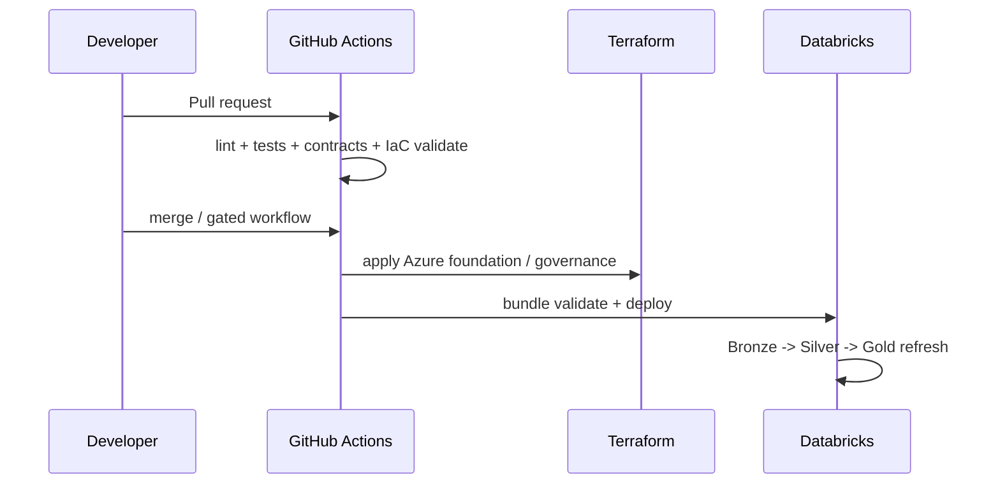

# Deployment Architecture

```mermaid
sequenceDiagram
  participant Dev as Developer
  participant GH as GitHub Actions
  participant TF as Terraform
  participant DB as Databricks
  Dev->>GH: Pull request
  GH->>GH: lint + tests + contracts + IaC validate
  Dev->>GH: merge / gated workflow
  GH->>TF: apply Azure foundation / governance
  GH->>DB: bundle validate + deploy
  DB->>DB: Bronze -> Silver -> Gold refresh
```

Platform and application lifecycles are deliberately independent so an application release does not recreate durable cloud infrastructure.
