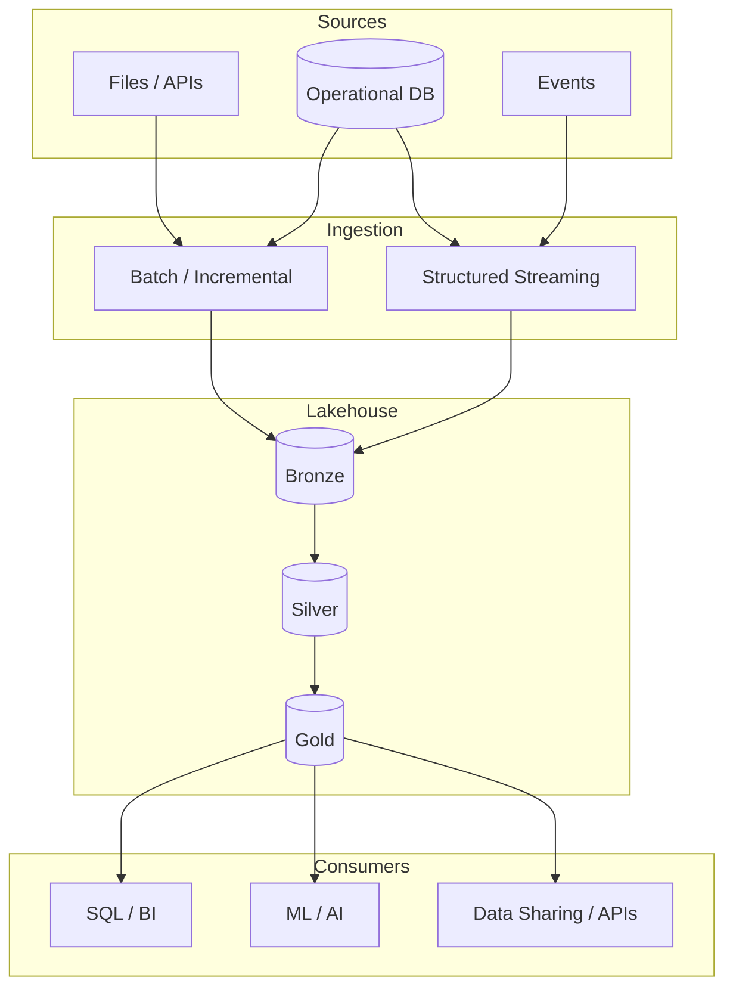

# Architecture Overview

## Scope

This reference architecture covers both the **platform** and **application** layers of an enterprise lakehouse.

The platform layer establishes cloud resources, networking, storage, identity, Databricks workspaces and Unity Catalog governance. The application layer implements data ingestion, transformation, quality and data products on top of that platform.

## Logical architecture

## Cross-cutting capabilities

- **Governance:** Unity Catalog, groups, ownership, data classification and lineage.
- **Security:** least privilege, workload identities, secrets, private networking and auditability.
- **Data quality:** contract validation, quarantine, expectations and reconciliation.
- **Observability:** freshness, latency, throughput, failures, retries and cost metrics.
- **DevOps/DataOps:** Git, pull requests, tests, Terraform, Bundles and environment promotion.
- **FinOps:** tagging, compute policies, autoscaling/serverless decisions and workload attribution.

## Environment strategy

The reference model uses separate `dev`, `staging` and `prod` deployment targets. Production is treated as a controlled environment: no human-owned production objects, no embedded credentials and no manual configuration that cannot be reproduced from source control.

## Data-layer responsibilities

### Bronze

- Preserve source fidelity and ingestion metadata.
- Favor append-only/replayable ingestion.
- Capture corrupt or unparseable records rather than silently dropping them.
- Avoid premature business logic.

### Silver

- Enforce schemas and business keys.
- Deduplicate and standardize records.
- Apply CDC semantics and reference-data conformance.
- Isolate rejected records with explicit quality reasons.

### Gold

- Publish domain-oriented data products.
- Optimize physical layout for consumer access patterns.
- Define stable business semantics and SLIs.
- Avoid exposing ingestion-specific implementation details.
