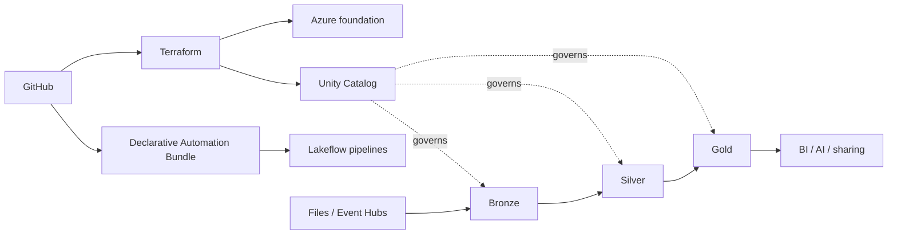

# Architecture Overview

This reference separates **durable platform infrastructure**, **workspace governance**, and **data-product delivery**. Terraform provisions Azure and Unity Catalog boundaries; Declarative Automation Bundles deploy Lakeflow pipelines/jobs; the retail domain publishes Bronze, Silver and Gold datasets.

See the physical, security, identity, deployment, observability and DR documents in this folder and the ADR index for decision rationale.
