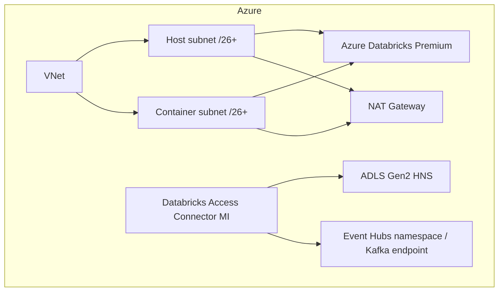

# Azure Physical Architecture

The classic-network variant uses two dedicated delegated subnets and explicit NAT egress. Application workloads remain serverless-first when organizational policy and feature support allow it. Private Link/private DNS is deliberately documented as an adoption variant rather than falsely claiming the public reference is fully private.
