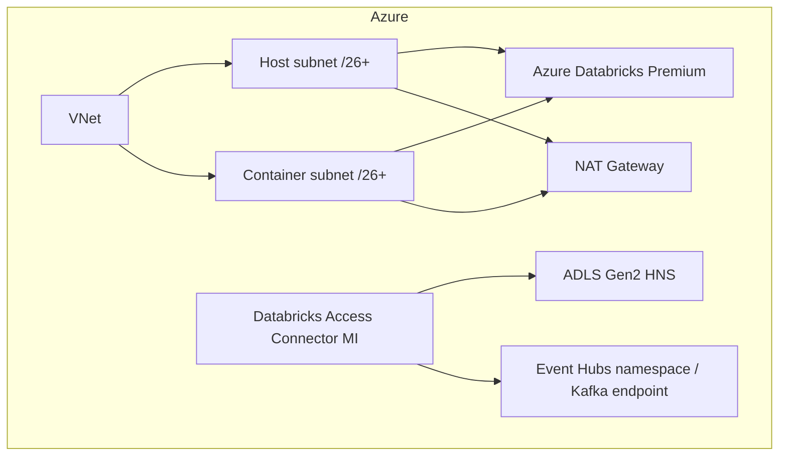
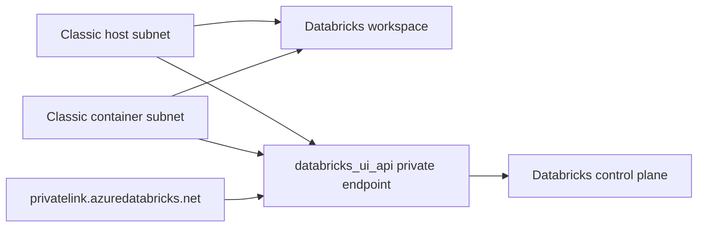

# Azure Physical Architecture

## Baseline classic-network profile

The baseline uses two dedicated delegated subnets, `no_public_ip=true` for classic compute and explicit NAT egress. Application workloads remain serverless-first when organizational policy and feature support allow it.

## Backend Private Link profile

When `enable_private_link=true`, Terraform creates a dedicated private-endpoint subnet and `databricks_ui_api` endpoint, links private DNS, removes the explicit NAT Gateway, and sets Required NSG Rules to `NoAzureDatabricksRules`. Workspace public network access remains enabled because this is a **classic-compute backend-only** profile.

Full private user/browser access and serverless private data connectivity require additional endpoint/network designs and are intentionally not implied by this toggle. See ADR-025 and `docs/patterns/private-link.md`.

## Secondary region

`infra/stacks/azure-dr-secondary` creates an independent VNet-injected workspace, storage, Access Connector and observability substrate in another Azure region. It can mirror the backend Private Link profile. Databricks Managed DR remains the preferred account-level replication/failover mechanism for in-scope metadata, managed data and workspace assets; see the DR architecture document.
