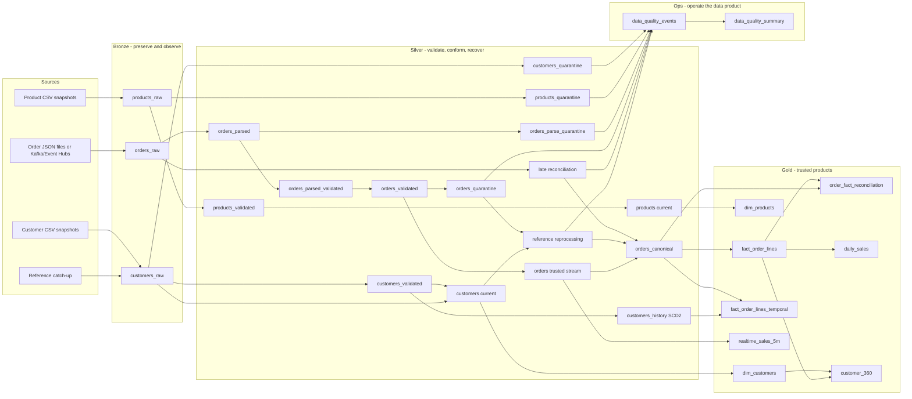

# Complete retail application pipeline

This is the application-side reference implementation for the repository. It demonstrates a complete source-to-consumption workflow using independent Bronze, Silver, Gold and Ops Lakeflow pipelines rather than collapsing ingestion, trust, consumption and operations into one job.

The goal is not merely to show medallion table names. Each boundary has explicit data semantics, failure behavior, recovery behavior and testable invariants.

## End-to-end graph



## Bronze: preserve source truth and replay evidence

Bronze owns ingestion only. It preserves raw source values and transport metadata without applying business corrections.

Snapshot sources use Auto Loader with rescued schema drift. Order events retain their immutable raw JSON envelope and file/Kafka transport metadata.

V1.6 adds operational metadata useful for idempotency, replay and forensic analysis:

- `_payload_hash` — deterministic payload fingerprint;
- `_source_system` — logical source ownership;
- `_ingested_at` — processing-time observation;
- `_ingestion_date` — operational date attribute;
- `_source_file` for file snapshots;
- Kafka topic/partition/offset/source timestamp for streaming orders;
- `_rescued_data` for unexpected snapshot fields.

Bronze expectations are metric/warn controls. A bad business record is not destroyed at ingestion.

Bronze deliberately does **not** normalize names, validate emails, enforce prices, join reference data, repair values or calculate business KPIs.

## Silver: the trust boundary

Silver owns conformance and data-quality disposition. Rules live in versioned YAML contracts separately from transformation code.

Contract rules carry:

- stable rule identifier;
- severity (`metric`, `quarantine`, `fail` where applicable);
- quality category;
- SQL expression;
- human-readable operational message;
- dataset/version metadata.

A contract expression must evaluate to `TRUE` to pass. `FALSE` **or `NULL`** is treated as a violation by the reusable Python quality annotation logic.

### Customer and product gate

The path is:

```text
standardize
  -> annotate rules
  -> metric expectations
  -> validated / quarantine split
  -> latest trusted state
  -> trusted invariants
```

Invalid source rows remain reason-preserving quarantine records. Trusted current-state tables are calculated only from validated input.

### Order gate 1 — structural validity before state

Orders are parsed before watermarking or deduplication. Malformed JSON, missing event identifiers and missing business keys are rejected before any stateful operation can hide them.

```text
orders_raw
  -> orders_parsed
  -> orders_ingest_checked
  -> orders_parsed_validated / orders_parse_quarantine
```

### Order gate 2 — event-time and business conformance

Only structurally valid events enter bounded stateful processing:

```text
watermark
  -> event-id deduplication
  -> current reference enrichment
  -> business/reference rules
  -> orders_validated / orders_quarantine
  -> trusted orders stream
```

Unknown customer/product references are quality events, not silently nullable joins.

### Deterministic batch deduplication

Canonical batch/recovery paths use deterministic ordering by event time, ingestion time and payload fingerprint when available. This is distinct from streaming event-id deduplication, whose purpose is bounded low-latency state.

## Quarantine and remediation are different concepts

A quarantine row is immutable evidence of what was rejected at a particular trust boundary.

V1.6 adds **reference-data reprocessing** for eventually-consistent dimensions:

```text
order arrives with customer C999
      ↓
orders_quarantine: known_customer
      ↓
customer C999 arrives later
      ↓
re-evaluate the complete current order contract
      ↓
all rules pass
      ↓
orders_reference_reprocess_candidates
      ↓
orders_canonical
```

The original quarantine row remains available for audit.

Reprocessing never assumes that fixing one rule makes the row valid. For example, a row rejected for both `known_customer` and `quantity_positive` remains rejected after the customer arrives if quantity is still invalid.

`orders_reference_reprocess_remaining` makes that behavior observable.

## Late events and reference-late events are separate recovery paths

The repository deliberately distinguishes:

- **event-time lateness** — a valid order arrives after the streaming watermark and is recovered from replayable Bronze;
- **reference-data lateness** — the event arrived on time but a required dimension did not yet exist.

Both paths converge into `orders_canonical`, but they solve different failure modes and retain different operational evidence.

## SCD1, SCD2 and temporal semantics

`silver.customers` is current state and is appropriate for current referential validation.

`silver.customers_history` is SCD Type 2 generated by Lakeflow AUTO CDC from validated customer input only.

V1.6 adds an explicit historical as-of fact:

```text
order.customer_id = customer_history.customer_id
order.event_time >= __START_AT
order.event_time < __END_AT   (or __END_AT is null)
```

`gold.fact_order_lines_temporal` stores the resolved customer-version interval, not customer PII attributes. A fail expectation requires each canonical fact to resolve to a historical customer version.

This demonstrates an important distinction:

- current-state dimension for operational validation;
- as-of dimension for historically correct analytics.

## Gold: model for consumers, do not repair upstream data

Gold assumes Silver canonical data is trusted. It publishes:

- `dim_customers` — current customer dimension;
- `dim_products` — current product dimension;
- `fact_order_lines` — canonical order-line fact;
- `fact_order_lines_temporal` — order fact with SCD2 customer-version interval;
- `daily_sales` — exact daily business KPIs;
- `customer_360` — lifetime customer order/value view;
- `realtime_sales_5m` — bounded streaming KPI;
- `order_fact_reconciliation` — dataset-level trusted-boundary accounting control.

Gold does not silently coerce negative values, invent reference rows or compensate for broken upstream invariants.

## Dataset-level assertions

Row quality alone cannot prove that a transformation preserved the dataset.

`order_fact_reconciliation` validates the trusted Silver-to-Gold boundary with two independent controls:

```text
COUNT(silver.orders_canonical) = COUNT(gold.fact_order_lines)
```

and:

```text
SUM(silver.quantity * silver.unit_price)
  ~= SUM(gold.line_amount)
```

The numeric comparison has an explicit tolerance. Row or amount mismatch fails the Gold flow because this indicates transformation regression rather than dirty source data.

Reusable helpers also support explicit accounting of accepted, quarantined and duplicate dispositions:

```text
source_rows
  = accepted_rows
  + quarantined_rows
  + duplicate_rows
```

## Expectations versus assertions

Lakeflow calls the runtime controls expectations. Their architectural roles differ by boundary:

| Control | Usage | Meaning |
|---|---|---|
| `expect` / `expect_all` | Bronze and quality metrics | observe without changing availability |
| `expect_all_or_drop` | Silver quality gates | keep invalid rows out of trusted output; matching quarantine preserves them |
| `expect_or_fail` / `expect_all_or_fail` | trusted Silver, Gold and reconciliation | assertion-like invariant; a trusted contract regressed |
| Python/pytest assertions | CI | verify reusable transformation and recovery semantics before deployment |

A source defect should normally be classified and quarantined. A broken trusted invariant should normally fail.

## Ops: quality is an operational data product

V1.6 deploys a dedicated `retail_ops` pipeline targeting the Unity Catalog `ops` schema.

`ops.data_quality_events` normalizes heterogeneous quarantine tables into a common payload-minimized model:

```text
dataset
stage
contract_version
rule_id
severity
category
message
expression
record_key
record_fingerprint
source_observed_at
materialized_at
```

Raw business payload is deliberately not copied into the Ops table. Business keys still require normal governance because identifiers may be sensitive.

`ops.data_quality_summary` aggregates failures by dataset, stage and rule for dashboards and alert thresholds.

Starter queries are available under `observability/sql/data_quality.sql` and `observability/sql/reconciliation.sql`.

## Failure behavior

| Failure | Detection | Outcome |
|---|---|---|
| New unexpected CSV fields | Bronze | preserved in `_rescued_data`; metric emitted |
| Empty order payload | Bronze | raw retained; anomaly visible |
| Broken JSON | Silver shape gate | quarantine before stateful processing |
| Missing event/customer/product key | Silver shape gate | quarantine |
| Duplicate event | Silver streaming state | event-id deduplication |
| Unknown customer/product | Silver business gate | quarantine with referential rule |
| Reference later arrives | Silver reprocessing | full contract re-evaluated; valid row can enter canonical surface |
| Reference arrives but quantity still invalid | Silver reprocessing | remains rejected |
| Late but otherwise valid event | Silver late reconciliation | recovered from Bronze into canonical surface |
| Canonical-to-fact row loss/duplication | Gold reconciliation | flow fails |
| Canonical-to-fact amount drift | Gold reconciliation | flow fails |
| Missing SCD2 customer version | Gold temporal fact | flow fails |
| Negative/null trusted Gold metric | Gold assertion | flow fails |

## Deterministic demonstration scenario

`make data` generates both the initial dataset and a second-phase reference catch-up fixture.

Initial run includes:

- customer update;
- invalid customer email;
- negative product price;
- duplicate order event;
- unknown customer `C999`;
- invalid order quantity;
- deliberately late event;
- corrupt JSON.

The generated `recovery/customers-reference-catchup.csv` later introduces `C999`. Upload it with `bash scripts/upload_reference_catchup.sh` and rerun the refresh to demonstrate reference-data remediation without mutating the original quarantine record.

## Deployment workflow

The Bundle deploys four serverless Lakeflow pipelines and one orchestration job:

```text
retail_bronze
    ↓
retail_silver
    ├────────→ retail_gold
    └────────→ retail_ops
```

Gold and Ops can refresh after the Silver trust boundary has completed.

## Testing strategy

Transformation code lives under `src/mdpr/retail/` and is tested outside Lakeflow decorators with local Spark.

The test suite covers:

- normalization and deterministic latest state;
- contract loading and compatibility;
- corrupt JSON parse status;
- event deduplication;
- late-event reconciliation;
- quarantine classification;
- reference-data reprocessing success;
- reprocessing that intentionally remains invalid;
- normalized quality-event metadata;
- SCD2 as-of temporal joins;
- explicit source/accepted/quarantine/duplicate accounting;
- Silver-to-Gold row and business-metric reconciliation;
- Gold dimensions, facts and aggregates.

Real Lakeflow expectation metrics, AUTO CDC behavior, streaming state/throughput and end-to-end table execution remain runtime evidence. They should be exercised in a disposable Databricks environment before being claimed as production-proven.

See [ADR-028](../adr/ADR-028-silver-quality-gates-and-invariants.md), [ADR-029](../adr/ADR-029-quality-telemetry-and-reprocessing.md) and [ADR-030](../adr/ADR-030-temporal-dimensional-consistency.md).
