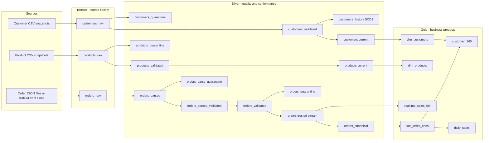

# Complete retail application pipeline

This is the application-side reference implementation for the repository. It demonstrates a complete source-to-consumption workflow using separate Bronze, Silver and Gold Lakeflow pipelines rather than collapsing all transformations into one job.

## End-to-end graph



## Layer responsibilities

### Bronze: preserve and observe

Bronze owns ingestion only. It keeps raw source fields and transport metadata, uses Auto Loader for snapshot files, and preserves the complete raw order JSON envelope for replay. Bronze expectations are **warn/measure only**: missing identifiers, rescued schema-drift fields, empty payloads and unsupported source values are visible in pipeline metrics but records are not dropped or failed.

Bronze deliberately does not normalize names, validate emails, enforce prices, join reference data, deduplicate business events or calculate business metrics.

### Silver: validate, quarantine, conform

Silver is the trust boundary. Rules live in YAML contracts so quality policy is versioned separately from transformation code.

Customers and products follow:

1. standardize types and representation;
2. annotate rows with `_dq_errors`;
3. evaluate metric-only expectations;
4. `expect_all_or_drop` invalid rows from the validated stream;
5. write the same rejected records to a quarantine table with reasons;
6. calculate the latest valid entity state;
7. use `expect_all_or_fail` as an assertion on the trusted output.

Orders intentionally have **two quality gates**:

1. **Ingest/shape gate** before watermarking: JSON parseability and required envelope keys are quarantined before any stateful operation.
2. **Conformance gate** after event-time deduplication and reference enrichment: quantity, price, customer/product integrity and business-time rules are quarantined.

Only after those gates is `silver.orders` published as the trusted low-latency stream. Late valid events that missed the watermark are recovered from replayable Bronze data into `orders_canonical` through the reconciliation path.

Customer SCD2 history is sourced from `customers_validated`, so invalid Bronze records cannot enter historical state.

## Expectations versus assertions

Lakeflow calls all of these controls **expectations**. In this reference, their behavior gives them different architectural roles:

| Control | Usage | Purpose |
|---|---|---|
| `expect` / `expect_all` | Bronze and metric rules | Observe quality without changing data |
| `expect_all_or_drop` | Silver quality gates | Keep invalid records out of trusted datasets while quarantine preserves them |
| `expect_or_fail` / `expect_all_or_fail` | Trusted Silver and Gold outputs | Assertion-like invariant: if this fails, the application contract or transformation has regressed |
| Python `assert` | pytest | Verify transformation behavior before deployment |

A row-level source problem should normally be quarantined, not stop the entire pipeline. Fail expectations are reserved for conditions that should be impossible **after** the quality gate.

## Gold: model for consumption

Gold does not repair source data. It assumes Silver is trusted and fails fast if downstream invariants are violated.

The reference publishes:

- `dim_customers`: current customer dimension;
- `dim_products`: current product dimension;
- `fact_order_lines`: canonical order-line fact with `order_date` and `line_amount`;
- `daily_sales`: exact batch-style daily sales KPIs;
- `customer_360`: customer-level lifetime order/value view;
- `realtime_sales_5m`: streaming five-minute KPIs.

`realtime_sales_5m` uses event-time watermarking, exact order-line counts and approximate distinct order/customer counts. Exact `countDistinct` is intentionally reserved for materialized/batch-style Gold views instead of the streaming aggregation.

## Failure behavior

| Failure | Where detected | Outcome |
|---|---|---|
| New unexpected CSV fields | Bronze | Preserved in `_rescued_data`, expectation metric emitted |
| Broken/empty JSON | Bronze/Silver ingest gate | Raw retained; parsed row quarantined before stateful processing |
| Missing event/customer/product keys | Silver ingest gate | Quarantine |
| Duplicate order event | Silver stateful conformance | Deduplicated by `event_id` with 30-minute watermark |
| Unknown customer/product | Silver conformance gate | Quarantine |
| Negative quantity/price | Silver conformance gate | Quarantine |
| Late but otherwise valid order | Silver reconciliation | Recovered into canonical batch surface |
| Negative Gold metric or null fact key | Gold assertion | Flow fails because trusted upstream assumptions were violated |

## Deployment workflow

The Bundle deploys three independent pipelines and one orchestration job:

```text
retail_bronze
    ↓
retail_silver
    ↓
retail_gold
```

`retail_refresh` enforces that dependency order for triggered refreshes while each layer keeps its own event log and operational boundary.

## Testing strategy

Transformation functions live under `src/mdpr/retail/transforms/` and are tested outside pipeline decorators with local Spark. Tests cover normalization, deterministic latest-state selection, JSON parse status, event deduplication, late-event recovery, quarantine behavior and Gold fact/dimension/aggregate logic.

Real pipeline expectation metrics, AUTO CDC behavior and end-to-end table graph execution remain environment/runtime evidence and should be exercised through the Lakeflow pipeline test/runtime path before claiming a production deployment.
